# Single Vendor Ecommerce Platform

A Django-based ecommerce web application with payment gateway integration, user authentication, and product management.


## Features

- User registration with email verification
- Google OAuth login
- Product browsing with categories
- Shopping cart management
- SSLCommerz payment gateway integration
- Order management and tracking
- Product rating system
- Admin dashboard for product and order management

## Tech Stack

- **Backend:** Django 6.0
- **Database:** SQLite
- **Authentication:** Django + django-allauth
- **Payment:** SSLCommerz
- **Frontend:** HTML, CSS, Bootstrap

## Installation

### 1. Clone Repository
```bash
git clone <repository-url>
cd ecommerce-project
```

### 2. Create Virtual Environment
```bash
python -m venv env
env\Scripts\activate  # Windows
source env/bin/activate  # Linux/Mac
```

### 3. Install Dependencies
```bash
pip install -r requirements.txt
```

### 4. Configure Environment Variables
Create `.env` file:
```env
SECRET_KEY=your-secret-key
DEBUG=True
EMAIL_HOST_USER=your-email@gmail.com
EMAIL_HOST_PASSWORD=your-app-password
SSLCOMMERZ_STORE_ID=your_store_id
SSLCOMMERZ_STORE_PASSWORD=your_store_password
```

### 5. Run Migrations
```bash
python manage.py makemigrations
python manage.py migrate
python manage.py createsuperuser
```

### 6. Run Server
```bash
python manage.py runserver
```

Visit: `http://localhost:8000`

## Project Structure

```
ecommerce-project/
├── accounts/              # User authentication
├── ecommerce/            # Main project settings
├── products/             # Products, cart, orders, payments
├── media/                # Uploaded images
├── static/               # CSS, JS files
├── templates/            # HTML templates
├── db.sqlite3           # Database
├── manage.py
└── requirements.txt
```

## URL Structure

### Authentication (`/account/`)
- `/account/register/` - User registration
- `/account/login/` - Login
- `/account/logout/` - Logout
- `/account/verify/<uidb64>/<token>/` - Email verification

### Products & Shopping
- `/` - Home page
- `/products/` - All products
- `/products/<category>/` - Products by category
- `/product/<slug>/` - Product details
- `/cart/` - Shopping cart
- `/cart/add/<id>/` - Add to cart
- `/cart/remove/<id>/` - Remove from cart
- `/cart/update/<id>/` - Update quantity

### Checkout & Payment
- `/checkout/` - Checkout page
- `/payment/process/` - Payment processing
- `/payment/success/<order_id>/` - Payment success
- `/payment/fail/<order_id>/` - Payment failed
- `/payment/cancel/<order_id>/` - Payment cancelled

### User Dashboard
- `/profile/` - User profile & orders
- `/rate/<product_id>/` - Rate product

### Google OAuth
- `/accounts/google/login/` - Google login

## Screenshots

### Home Page
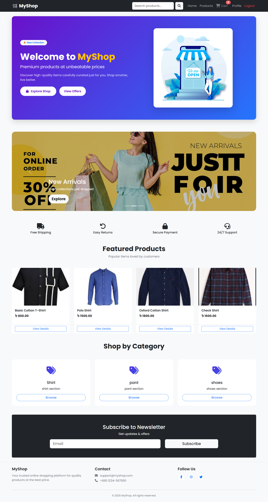
---

### Product Listing
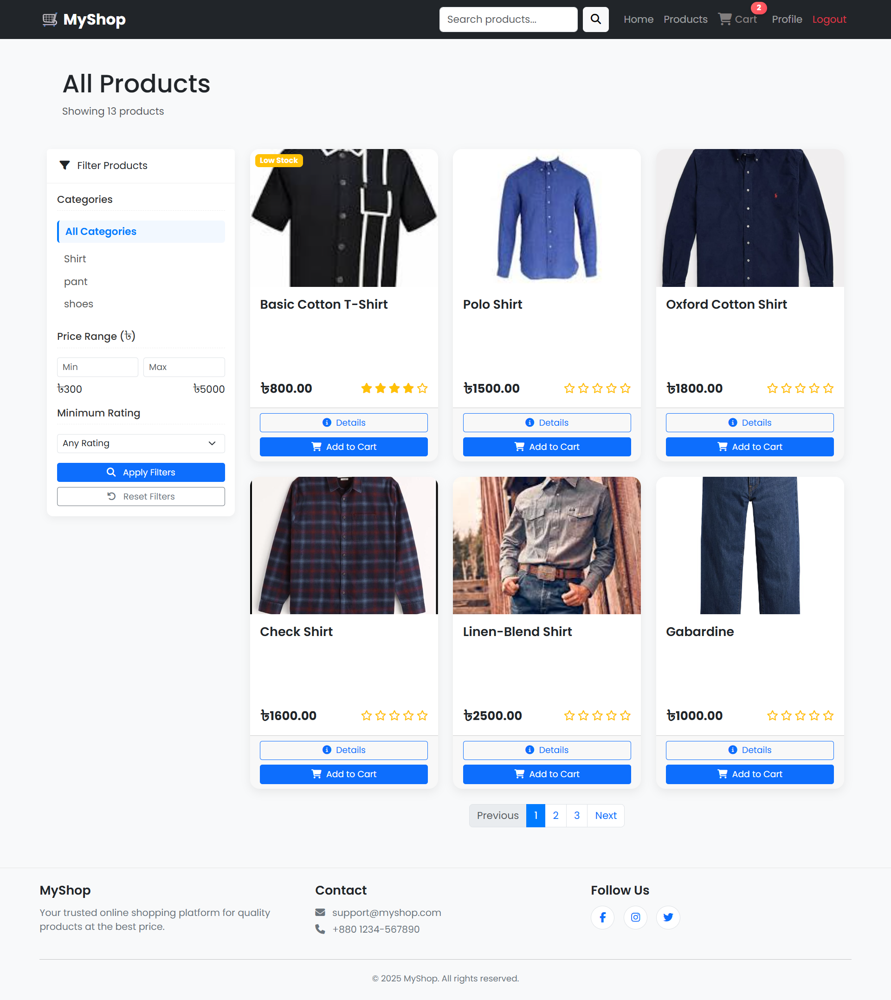
---

### Product Details
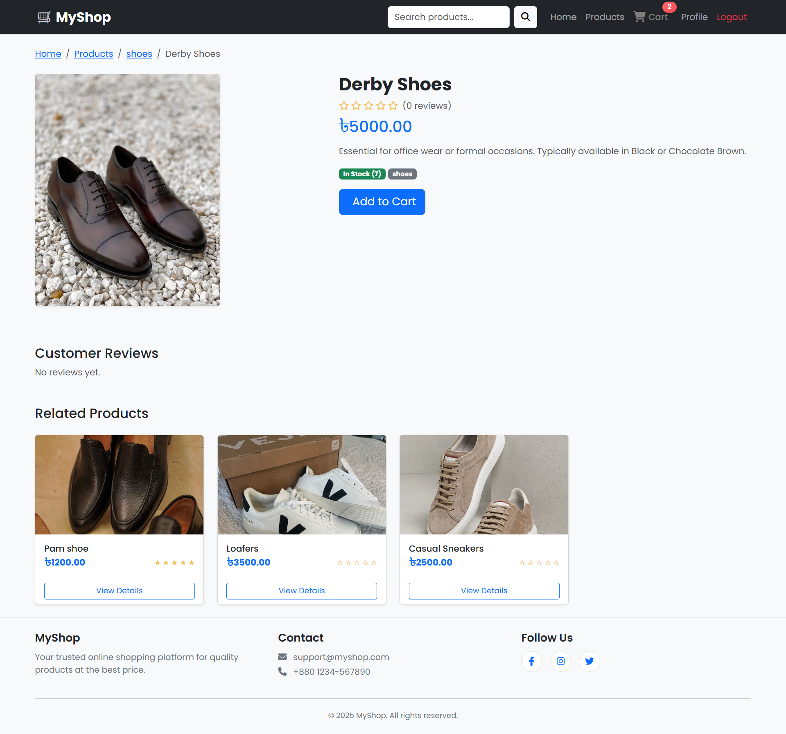
---

### Shopping Cart
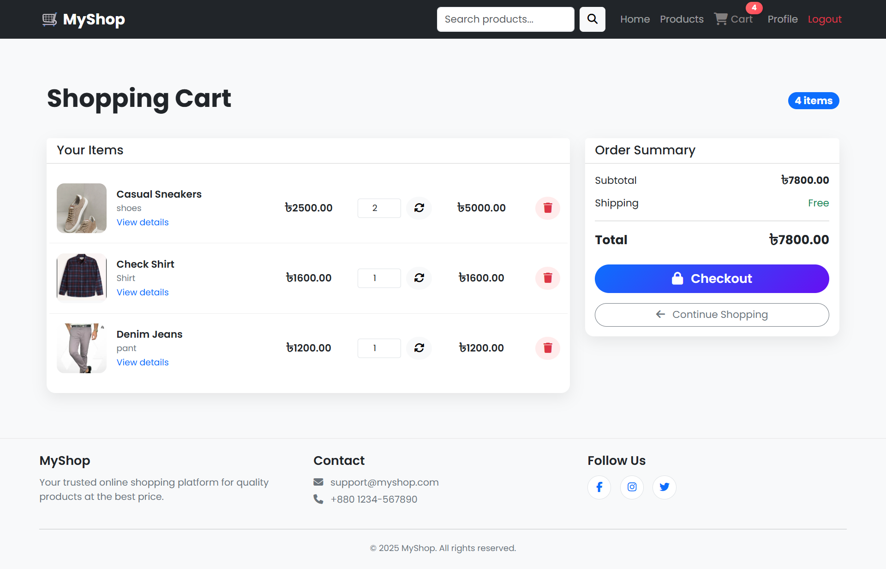
---

### Checkout
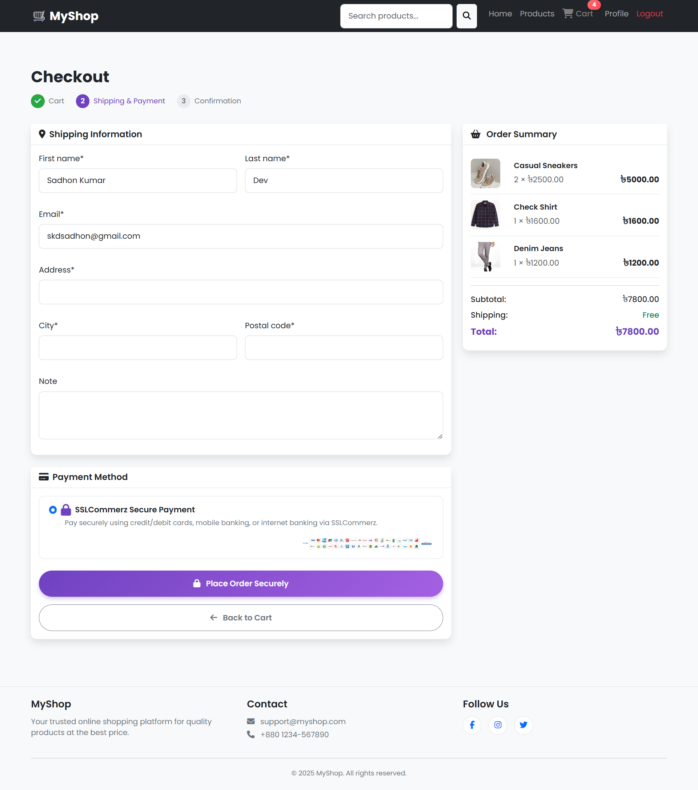
---

### Payment Gateway
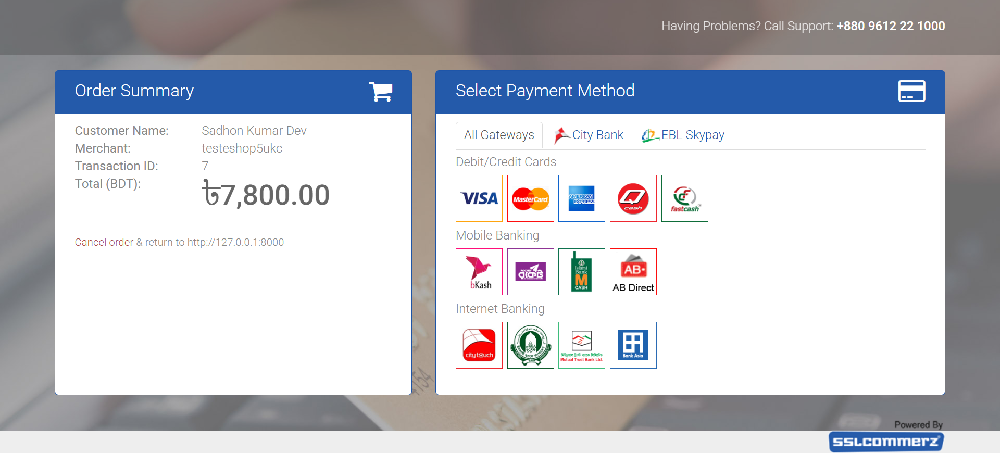
---

### User Dashboard
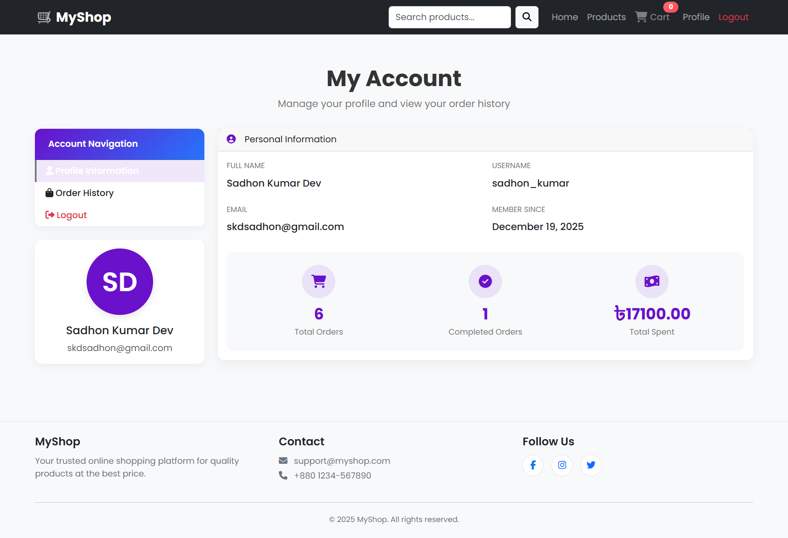
---

### Order History
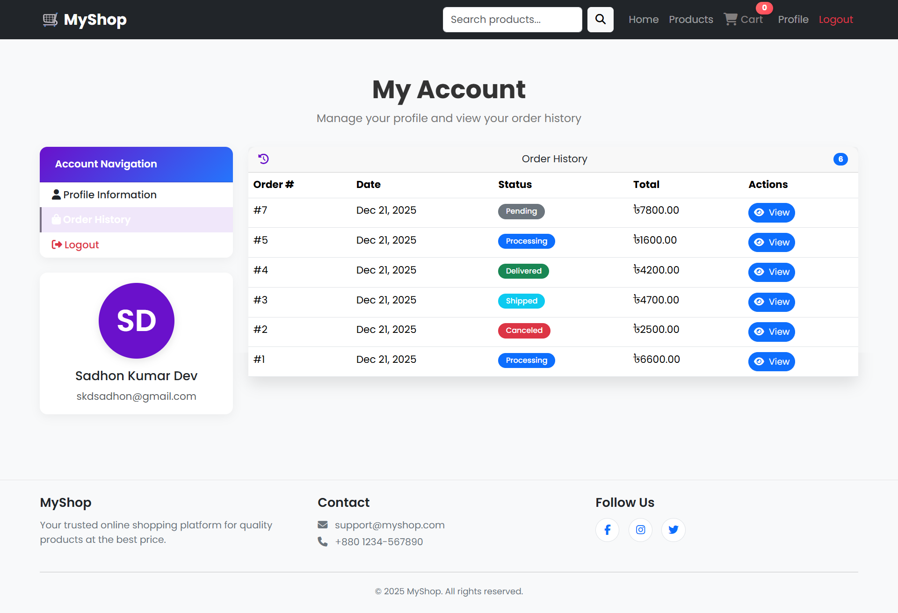
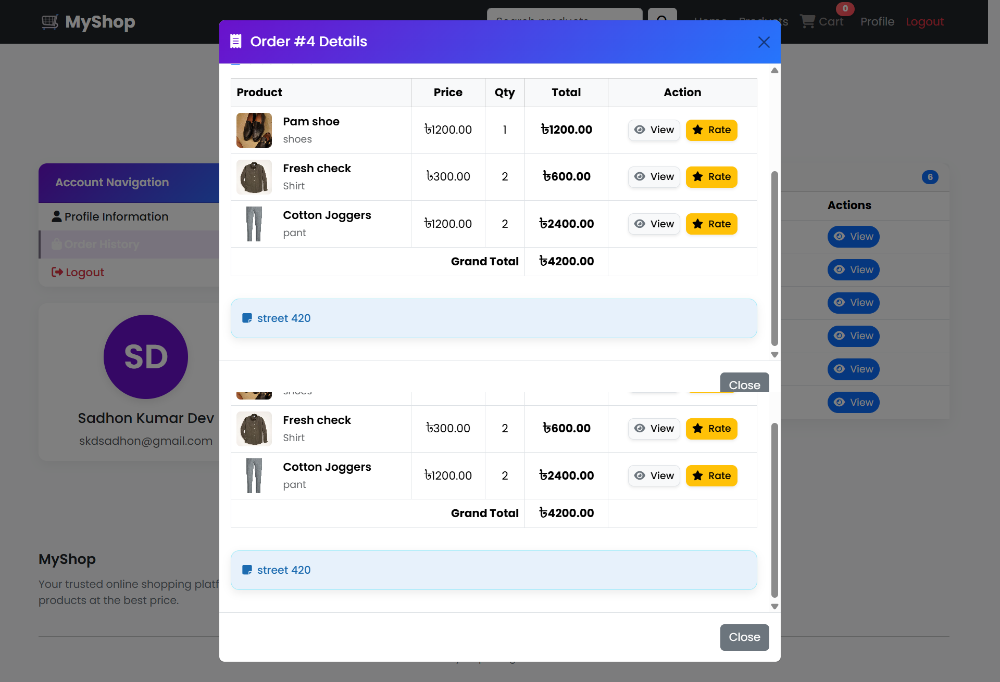
---

### Admin Panel - Products
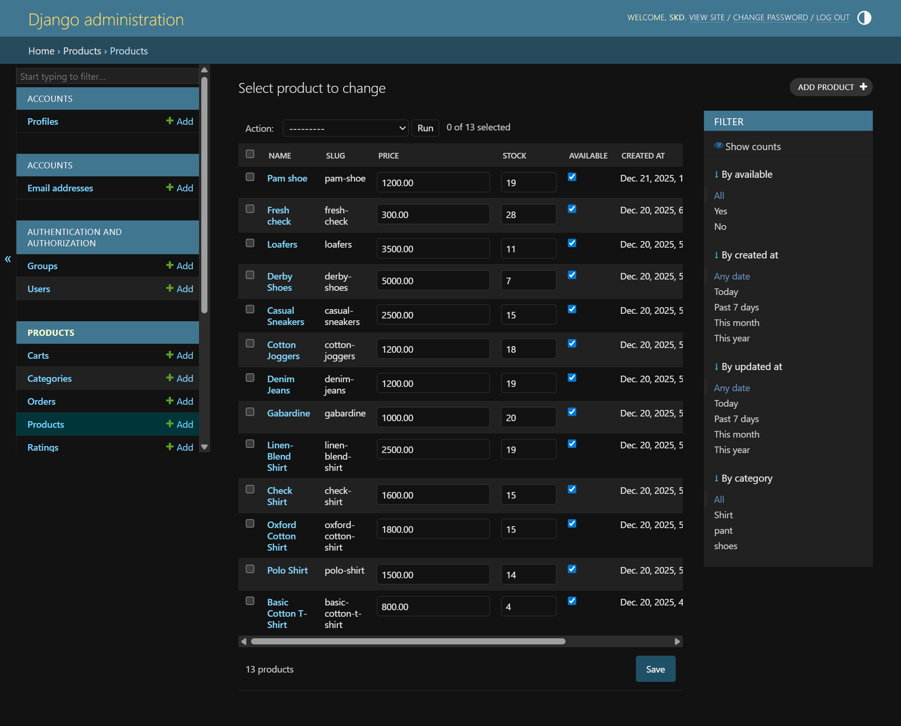
---

### Admin Panel - Orders
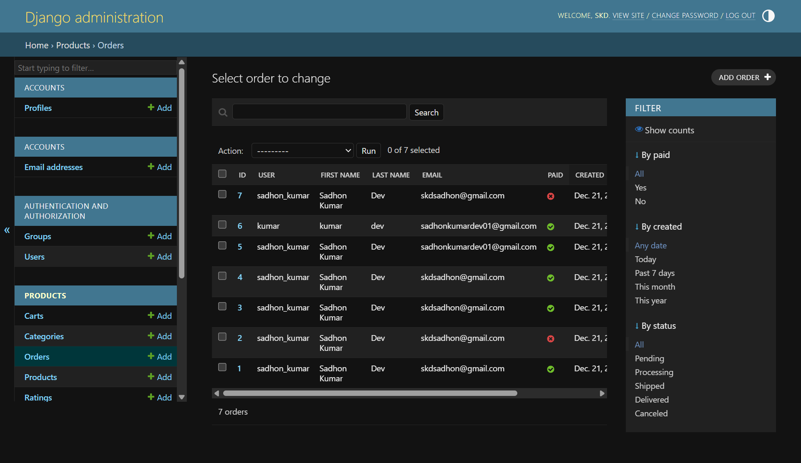
---

## Configuration

### Email Setup (Gmail)
1. Enable 2-factor authentication
2. Generate App Password
3. Add to `.env` file

### SSLCommerz Setup
1. Register at SSLCommerz
2. Get Store ID and Password
3. Use Sandbox mode for testing

### Google OAuth
1. Create project in Google Cloud Console
2. Enable Google+ API
3. Create OAuth credentials
4. Add redirect URI: `http://localhost:8000/accounts/google/login/callback/`

## Usage

### For Users
1. Register and verify email
2. Browse products
3. Add items to cart
4. Checkout and pay via SSLCommerz
5. Track orders in profile

### For Admin
1. Login to `/admin`
2. Manage products
3. Process orders
4. Update order status

